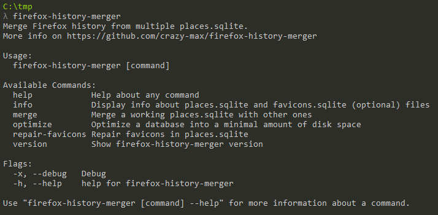

<p align="center"><a href="https://github.com/crazy-max/firefox-history-merger" target="_blank"></a></p>

<p align="center">
  <a href="https://github.com/crazy-max/firefox-history-merger/releases/latest"></a>
  <a href="#databases-schema"></a>
  <a href="https://github.com/crazy-max/firefox-history-merger/releases/latest"></a>
  <a href="https://travis-ci.org/crazy-max/firefox-history-merger"></a>
  <a href="https://goreportcard.com/report/github.com/crazy-max/firefox-history-merger"></a>
  <a href="https://www.codacy.com/app/crazy-max/firefox-history-merger"></a>
  <a href="https://www.paypal.com/cgi-bin/webscr?cmd=_s-xclick&hosted_button_id=ZMSMB3MERGPE8"></a>
</p>

## About

**firefox-history-merger** is a CLI application written in [Go](https://golang.org/) to merge history of 🦊 [Firefox](https://www.mozilla.org/en-US/firefox/) from a list of `places.sqlite` files and repair missing favicons with ease.


> Screenshot of firefox-history-merger

## Features

* Merge history (`moz_places`) from `places.sqlite` file
* `moz_hosts`, `moz_historyvisits` are also merged
* [Frecency](https://developer.mozilla.org/en-US/docs/Mozilla/Tech/Places/Frecency_algorithm) is recalculated during the merge
* Repair favicons
* Display info about `places.sqlite` and `favicons.sqlite`
* Optimize the databases into a minimal amount of disk space

## Requirements

**firefox-history-merger** uses a particular format for its versioning: **major.minor.patchlevel**. Minor marks the compatible Firefox version, like 57, 58, etc... So before using this application, check if your `places.sqlite` is compatible with firefox-history-merger with the `info` command.

## Download

| File name                                                                                                                                                             | OS      | Arch    |
| --------------------------------------------------------------------------------------------------------------------------------------------------------------------- | ------- | ------- |
| **[firefox-history-merger-1.60.0-darwin-amd64](https://github.com/crazy-max/firefox-history-merger/releases/download/1.60.0/firefox-history-merger-1.60.0-darwin-amd64)**           | macOS   | x86-64  |
| [firefox-history-merger-1.60.0-darwin-386](https://github.com/crazy-max/firefox-history-merger/releases/download/1.60.0/firefox-history-merger-1.60.0-darwin-386)                   | macOS   | x86     |
| **[firefox-history-merger-1.60.0-linux-amd64](https://github.com/crazy-max/firefox-history-merger/releases/download/1.60.0/firefox-history-merger-1.60.0-linux-amd64)**             | Linux   | x86-64  |
| [firefox-history-merger-1.60.0-linux-386](https://github.com/crazy-max/firefox-history-merger/releases/download/1.60.0/firefox-history-merger-1.60.0-linux-386)                     | Linux   | x86     |
| **[firefox-history-merger-1.60.0-windows-amd64.exe](https://github.com/crazy-max/firefox-history-merger/releases/download/1.60.0/firefox-history-merger-1.60.0-windows-amd64.exe)** | Windows | x86-64  |
| [firefox-history-merger-1.60.0-windows-386.exe](https://github.com/crazy-max/firefox-history-merger/releases/download/1.60.0/firefox-history-merger-1.60.0-windows-386.exe)         | Windows | x86     |

## Usage

First close Firefox and copy `places.sqlite` and `favicons.sqlite` files from [your Firefox profile folder](https://support.mozilla.org/en-US/kb/profiles-where-firefox-stores-user-data) somewhere.

In the following examples, this folder structure will be used :

```
[-] other_places_folder
  | places_20160821.sqlite
  | places_20170720.sqlite
firefox-history-merger.exe
places.sqlite
favicons.sqlite
```

### Info

You probably want to have more info about your `places.sqlite` and `favicons.sqlite` files you have before merging history with others. Just type the command below (`favicons.sqlite` is optionnal).

```
$ firefox-history-merger info "places.sqlite" "favicons.sqlite"
Checking and opening DBs...

Schema version:   v39 (Firefox >= 57)
Compatible:       YES
History entries:  293176
Places entries:   129947
Icons entries:    6538
Last used on:     2017-12-09 18:26:56
```

### Merge

Now execute this command to merge the `*.sqlite` files in `other_places_folder/` with your working `places.sqlite` :

```
$ firefox-history-merger merge "places.sqlite" "other_places_folder/" --merge-full
Checking and opening DBs...

Working DB is 'places.sqlite'
Backing up 'places.sqlite' to 'places.sqlite.20171209183822'...

The following tables will be merged:
- moz_places
- moz_historyvisits (inc. in moz_places process)
- moz_hosts

Looking for *.sqlite DBs in 'other_places_folder/'
2 valid DB(s) found:
- places_20170720.sqlite (57093 entries ; last used on 2017-07-20 18:31:11)
- places_20160821.sqlite (101208 entries ; last used on 2016-08-21 19:27:34)

## Merging DB 'places_20170720.sqlite'...
moz_places 57093 / 57093 [=============================================================================] 100.00%
moz_hosts 4422 / 4422 [=======================================================================================] 100.00%

## Merging DB 'places_20160821.sqlite'...
moz_places 101208 / 101208 [=============================================================================] 100.00%
moz_hosts 5893 / 5893 [=======================================================================================] 100.00%
```

### Repair favicons

If you want you can also repair missing favicons. It can take a long time depending on the number of entries in your history, since the favicon will be recovered for each entry if there is no attached favicon.

```
$ firefox-history-merger repair-favicons "places.sqlite" "favicons.sqlite"
Checking and opening DBs...
Backing up 'places.sqlite' to 'places.sqlite.20180127163723'
Backing up 'favicons.sqlite' to 'favicons.sqlite.20180127163725'

Places to check:           311629
Last moz_icons.id:         7309
Last moz_pages_w_icons.id: 62284

## Repairing favicons...
moz_icons 311629 / 311629 [=======================================================================================] 100.00%
```

## TODO

* [ ] Merge `moz_annos` and `moz_inputhistory`
* [ ] Merge ancestors of `moz_historyvisits`
* [ ] Optimize the repair of favicons 

## About Firefox places

### Places expiration limit

As stipulated in this [StackExchange thread](https://superuser.com/questions/895302/how-do-i-set-max-browsing-history-size/995459#995459), the relevant function is `_loadPrefs()` in [nsPlacesExpiration.js](https://dxr.mozilla.org/mozilla-central/source/toolkit/components/places/nsPlacesExpiration.js#714). It tries to determine the limit by first checking `PREF_MAX_URIS` (which is `"max_pages"`). If `PREF_MAX_URIS` isn't set or is a negative value, it then attempts to calculate the 'optimal database size' based on available memory and disk space.

So if you want to retain all history ('infinite' history), you could set `places.history.expiration.max_pages` to 2147483647 (the highest 32-bit signed integer) in `about:config`.

Once you create it and set it, check the value of `places.history.expiration.transient_current_max_pages`. It should automatically adjust itself to match your `max_pages` setting. 

### Databases schema

Database schema version is stored in `user_version` [pragma statement](https://sqlite.org/pragma.html). Linked Firefox version to database schema can be found in [Database.cpp](https://dxr.mozilla.org/mozilla-central/source/toolkit/components/places/Database.cpp#993).


> [Edit this diagram](https://www.draw.io/?title=firefox_v43.png&url=https%3A%2F%2Fraw.githubusercontent.com%2Fcrazy-max%2Ffirefox-history-merger%2Fmaster%2F.res%2Fschemas%2Fv43.png%3Ft%3D0) in your browser. 

## How can i help ?

All kinds of contributions are welcomed :raised_hands:!<br />
The most basic way to show your support is to star :star2: the project, or to raise issues :speech_balloon:<br />
But we're not gonna lie to each other, I'd rather you buy me a beer or two :beers:!

[](https://www.paypal.com/cgi-bin/webscr?cmd=_s-xclick&hosted_button_id=ZMSMB3MERGPE8)

## License

MIT. See `LICENSE` for more details.<br />
Icon credit to [Zlatko Najdenovski](http://pixelbazaar.com/) (firefox icon) and [BomSymbols](https://creativemarket.com/BomSymbols) (clock icon).
