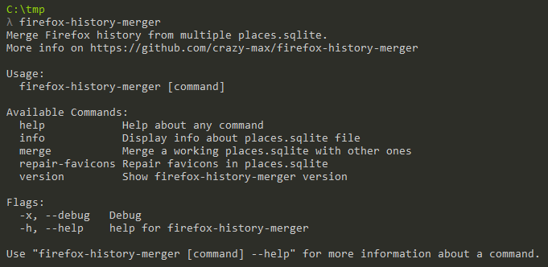

<p align="center"><a href="https://github.com/crazy-max/firefox-history-merger" target="_blank"></a></p>

<p align="center">
  <a href="https://github.com/crazy-max/firefox-history-merger/releases/latest"></a>
  <a href="https://github.com/crazy-max/firefox-history-merger/releases/latest"></a>
  <a href="https://travis-ci.org/crazy-max/firefox-history-merger"></a>
  <a href="https://goreportcard.com/report/github.com/crazy-max/firefox-history-merger"></a>
  <a href="https://www.codacy.com/app/crazy-max/firefox-history-merger"></a>
  <a href="https://www.paypal.com/cgi-bin/webscr?cmd=_s-xclick&hosted_button_id=ZMSMB3MERGPE8"></a>
</p>

## About

**firefox-history-merger** is a CLI application written in [Go](https://golang.org/) to merge history of 🦊 [Firefox](https://www.mozilla.org/en-US/firefox/) from a list of `places.sqlite` file into one with ease.


> Screenshot of firefox-history-merger

## Features

* Merge history (`moz_places`) from `places.sqlite` files
* `moz_hosts`, `moz_favicons`, `moz_historyvisits` are also merged
* Auto migration of `places.sqlite` schema database to the last one used by firefox-history-merger
* [Frecency](https://developer.mozilla.org/en-US/docs/Mozilla/Tech/Places/Frecency_algorithm) is recalculated during the merge
* Repair favicons
* Display info about a `places.sqlite`

## TODO

* [ ] Add support for Firefox 56
* [ ] Merge `moz_annos` and `moz_inputhistory`
* [ ] Merge ancestors of `moz_historyvisits`
* [ ] Use goroutines to parallelize merge process

## Requirements

The schema used by firefox-history-merger is based on **Firefox 57** (places v39). If you use an older schema, the database schema will be merged to this version. So be careful with the working `places.sqlite` you want to merge.<br />
You can check the compatibility of your working `places.sqlite` with the `info` command.

## Usage

First close Firefox and copy your `places.sqlite` from [your Firefox profile folder](https://support.mozilla.org/en-US/kb/profiles-where-firefox-stores-user-data) somewhere. 

You probably want to have more info about your `places.sqlite` file you have before merging history with others :

```
$ firefox-history-merger info places.sqlite

Filename:         places.sqlite
Hash:             4ec4303f706cd6895f85dcde338a97d23b849918e959c70dc22b21df15f6f810
Schema version:   v39 (Firefox >= 57)
History entries:  293176
Places entries:   129947
Last used on:     2017-12-09 18:26:56
```

Now if you want to merge your current `places.sqlite` with others, here is the folder structure used in this example :

```
[-] other_places_folder
 | places_20160821.sqlite
 | places_20170720.sqlite
firefox-history-merger.exe
places.sqlite
```

Then execute this command to merge the `*.sqlite` files in `./other_places_folder/` with the working `places.sqlite` :

```
$ firefox-history-merger merge places.sqlite ./other_places_folder/ --merge-full

Working DB is 'places.sqlite'
Backing up working DB to 'places.sqlite.20171209183822'...

The following tables will be merged:
- moz_places
- moz_favicons (inc. in moz_places)
- moz_historyvisits (inc. in moz_places)
- moz_hosts

Looking for *.sqlite DBs in './other_places_folder/'
2 valid DB(s) found:
- places_20170720.sqlite (57093 entries ; last used on 2017-07-20 18:31:11)
- places_20160821.sqlite (101208 entries ; last used on 2016-08-21 19:27:34)

## Merging DB 'places_20170720.sqlite'...
moz_places 57093 / 57093 [=============================================================================] 100.00%
moz_hosts 4422 / 4422 [=======================================================================================]  100.00%

## Merging DB 'places_20160821.sqlite'...
moz_places 101208 / 101208 [=============================================================================] 100.00%
moz_hosts 5893 / 5893 [=======================================================================================]  100.00%
```

## About Firefox places

### Places expiration limit

As stipulated in this [StackExchange thread](https://superuser.com/questions/895302/how-do-i-set-max-browsing-history-size/995459#995459), the relevant function is `_loadPrefs()` in [nsPlacesExpiration.js](https://dxr.mozilla.org/mozilla-central/source/toolkit/components/places/nsPlacesExpiration.js#714). It tries to determine the limit by first checking `PREF_MAX_URIS` (which is `"max_pages"`). If `PREF_MAX_URIS` isn't set or is a negative value, it then attempts to calculate the 'optimal database size' based on available memory and disk space.

So if you want to retain all history ('infinite' history), you could set `places.history.expiration.max_pages` to 2147483647 (the highest 32-bit signed integer) in `about:config`.

Once you create it and set it, check the value of `places.history.expiration.transient_current_max_pages`. It should automatically adjust itself to match your `max_pages` setting. 

### Database schema

Schema version of database is stored in `user_version` [pragma statement](https://sqlite.org/pragma.html). Linked Firefox version to database schema can be found in [Database.cpp](https://dxr.mozilla.org/mozilla-central/source/toolkit/components/places/Database.cpp#993).


> [Edit this diagram](https://www.draw.io/?title=places_v39.png&url=https%3A%2F%2Fraw.githubusercontent.com%2Fcrazy-max%2Ffirefox-history-merger%2Fmaster%2F.res%2Fschemas%2Fplaces_v39.png%3Ft%3D0) in your browser. 

## How can i help ?

We welcome all kinds of contributions :raised_hands:!<br />
The most basic way to show your support is to star :star2: the project, or to raise issues :speech_balloon:<br />
Any funds donated will be used to help further development on this project! :gift_heart:

[](https://www.paypal.com/cgi-bin/webscr?cmd=_s-xclick&hosted_button_id=ZMSMB3MERGPE8)

## License

MIT. See `LICENSE` for more details.<br />
Icon credit to [Zlatko Najdenovski](http://pixelbazaar.com/) (firefox icon) and [BomSymbols](https://creativemarket.com/BomSymbols) (clock icon).
