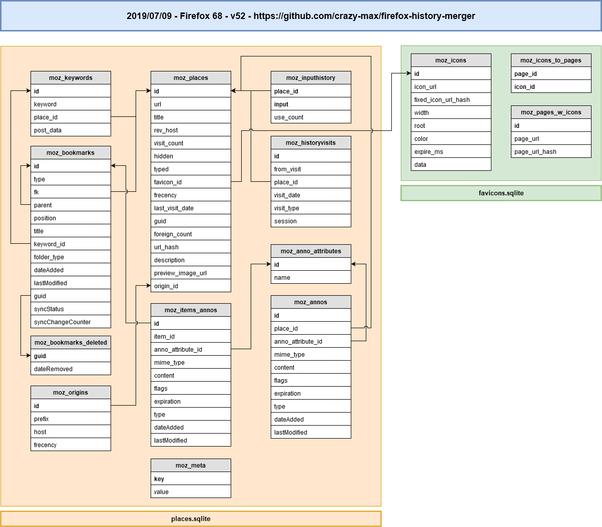

<p align="center"><a href="https://github.com/crazy-max/firefox-history-merger" target="_blank"></a></p>

<p align="center">
  <a href="https://github.com/crazy-max/firefox-history-merger/releases/latest"></a>
  <a href="https://github.com/crazy-max/firefox-history-merger/releases/latest"></a>
  <a href="https://travis-ci.com/crazy-max/firefox-history-merger"></a>
  <a href="https://goreportcard.com/report/github.com/crazy-max/firefox-history-merger"></a>
  <a href="https://www.codacy.com/app/crazy-max/firefox-history-merger"></a>
  <br /><a href="https://www.patreon.com/crazymax"></a>
  <a href="https://www.paypal.com/cgi-bin/webscr?cmd=_s-xclick&hosted_button_id=ZMSMB3MERGPE8"></a>
</p>

## About

**firefox-history-merger** is a CLI application written in [Go](https://golang.org/) to merge history of 🦊 [Firefox](https://www.mozilla.org/en-US/firefox/) and repair missing favicons with ease.


> Screenshot of firefox-history-merger

## Features

* Merge history (`moz_places`) from `places.sqlite` file
* `moz_historyvisits` are also merged
* [Frecency](https://developer.mozilla.org/en-US/docs/Mozilla/Tech/Places/Frecency_algorithm) is recalculated during the merge
* Repair favicons
* Display info about `places.sqlite`
* Optimize database into a minimal amount of disk space

## Requirements

Schema version that can be used is **v39 (Firefox 57)** to **v52 (Firefox 68)**. Check if your `places.sqlite` is compatible with `info` command.

If your database is not compatible, you can copy your `places.sqlite` in a compatible Firefox [profile folder](https://support.mozilla.org/en-US/kb/profiles-where-firefox-stores-user-data), then launch/close Firefox and your `places.sqlite` should now be compatible. 

## Download

You can download the application matching your platform on the [**releases page**](https://github.com/crazy-max/firefox-history-merger/releases/latest).

## Usage

First close Firefox and copy `places.sqlite` and `favicons.sqlite` files from [your Firefox profile folder](https://support.mozilla.org/en-US/kb/profiles-where-firefox-stores-user-data) somewhere.

In the following examples, this folder structure will be used :

```
favicons.sqlite
firefox-history-merger.exe
places.sqlite
places_to_merge.sqlite
```

### Info

You probably want to have more info about your `places.sqlite` database you have before merging history:

```
$ firefox-history-merger info places.sqlite
Sun, 23 Jun 2019 03:43:47 CEST INF Schema version:         v52 (Firefox >= 65)
Sun, 23 Jun 2019 03:43:48 CEST INF Compatible:             true
Sun, 23 Jun 2019 03:43:48 CEST INF Places entries:         1934
Sun, 23 Jun 2019 03:43:48 CEST INF Historyvisits entries:  1678
Sun, 23 Jun 2019 03:43:48 CEST INF Last used on:           2019-06-21 02:31:46
```

### Merge

Now execute this command to merge `places_to_merge.sqlite` with your working `places.sqlite` :

```
$ firefox-history-merger merge places.sqlite places_to_merge.sqlite
Sun, 23 Jun 2019 04:33:58 CEST INF 5199 places will be merged
Sun, 23 Jun 2019 04:33:58 CEST INF Merging 1000 places (1/6)...
Sun, 23 Jun 2019 04:33:59 CEST INF Merging 1000 places (2/6)...
Sun, 23 Jun 2019 04:34:01 CEST INF Merging 1000 places (3/6)...
Sun, 23 Jun 2019 04:34:03 CEST INF Merging 1000 places (4/6)...
Sun, 23 Jun 2019 04:34:05 CEST INF Merging 1000 places (5/6)...
Sun, 23 Jun 2019 04:34:07 CEST INF Merging 199 places (6/6)...
Sun, 23 Jun 2019 04:34:09 CEST INF Optimizing database...
Sun, 23 Jun 2019 04:34:09 CEST INF Finished created=4478 errors=0 total=5199 updated=721
```

### Repair favicons

If you want you can also repair missing favicons. It can take a long time depending on the number of entries in your history, since the favicon will be recovered for each entry if there is no attached favicon.

```
$ firefox-history-merger repair-favicons places.sqlite favicons.sqlite
Sun, 23 Jun 2019 04:29:02 CEST INF Checking 1948 places...
Sun, 23 Jun 2019 04:29:02 CEST INF Favicon repaired favicon_id=18575 left=1938 places_id=33864 url=https://github.com/
Sun, 23 Jun 2019 04:29:05 CEST ERR Cannot get favicon error="no favicon found" favicon_id=0 left=1845 places_id=200497 url=http://www.videojs.com/
...
Sun, 23 Jun 2019 04:32:54 CEST ERR Cannot get favicon error="no favicon found" favicon_id=0 left=1 places_id=1955773 url=https://docs.docker.com/v17.09/engine/admin/logging/view_container_logs/
Sun, 23 Jun 2019 04:32:54 CEST INF Finished errors=618 linked=873 repaired=402 skipped=23 total=1948 valid=32
```

## About Firefox places

### Places expiration limit

As stipulated in this [StackExchange thread](https://superuser.com/questions/895302/how-do-i-set-max-browsing-history-size/995459#995459), the relevant function is `_loadPrefs()` in [nsPlacesExpiration.js](https://dxr.mozilla.org/mozilla-central/source/toolkit/components/places/nsPlacesExpiration.js#714). It tries to determine the limit by first checking `PREF_MAX_URIS` (which is `"max_pages"`). If `PREF_MAX_URIS` isn't set or is a negative value, it then attempts to calculate the 'optimal database size' based on available memory and disk space.

So if you want to retain all history ('infinite' history), you could set `places.history.expiration.max_pages` to 2147483647 (the highest 32-bit signed integer) in `about:config`.

Once you create it and set it, check the value of `places.history.expiration.transient_current_max_pages`. It should automatically adjust itself to match your `max_pages` setting. 

### Databases schema

Database schema version is stored in `user_version` [pragma statement](https://sqlite.org/pragma.html). Linked Firefox version to database schema can be found in [Database.cpp](https://dxr.mozilla.org/mozilla-central/source/toolkit/components/places/Database.cpp#993).


> [Edit this diagram](https://www.draw.io/?title=firefox_v52.png&url=https%3A%2F%2Fraw.githubusercontent.com%2Fcrazy-max%2Ffirefox-history-merger%2Fmaster%2F.res%2Fschemas%2Fv52.png%3Ft%3D0) in your browser. 

## How can I help ?

All kinds of contributions are welcome :raised_hands:!<br />
The most basic way to show your support is to star :star2: the project, or to raise issues :speech_balloon:<br />
But we're not gonna lie to each other, I'd rather you buy me a beer or two :beers:!

[](https://www.patreon.com/crazymax) 
[](https://www.paypal.com/cgi-bin/webscr?cmd=_s-xclick&hosted_button_id=ZMSMB3MERGPE8)

## License

MIT. See `LICENSE` for more details.<br />
Icon credit to [Zlatko Najdenovski](http://pixelbazaar.com/) (firefox icon) and [BomSymbols](https://creativemarket.com/BomSymbols) (clock icon).
